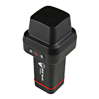

SparkFun RTK Everywhere Firmware Binaries
===========================================================

The line of RTK Everywhere products offered by SparkFun all run identical firmware. The [RTK Everywhere firmware](https://github.com/sparkfun/SparkFun_RTK_Everywhere_Firmware) is written for the following products:

<table class="table table-hover table-striped table-bordered">
	<tr align="center">
		<td></td>
		<td></td>
	</tr>
	<tr align="center">
		<td><a href="https://www.sparkfun.com/sparkfun-rtk-evk.html">SparkFun RTK EVK (GPS-24342)</a></td>
		<td><a href="https://www.sparkfun.com/sparkpnt-rtk-facet-mosaic-l-band.html">SparkFun RTK Facet mosaic (GPS-24903)</a></td>
	</tr>
	<tr align="center">
		<td><a href="https://docs.sparkfun.com/SparkFun_RTK_EVK/">Hookup Guide</a></td>
		<td><a href="https://docs.sparkfun.com/SparkFun_RTK_Facet_mosaic/">Hookup Guide</a></td>
	</tr>
	<tr align="center">
		<td></td>
		<td></td>
	</tr>
	<tr align="center">
		<td><a href="https://www.sparkfun.com/sparkfun-rtk-postcard.html">SparkFun RTK Postcard (GPS-26916)</a></td>
		<td><a href="https://www.sparkfun.com/products/25662">SparkFun RTK Torch (GPS-25662)</a></td>
	</tr>
	<tr align="center">
		<td><a href="https://docs.sparkfun.com/SparkFun_RTK_Postcard/">Hookup Guide</a></td>
		<td><a href="https://docs.sparkfun.com/SparkFun_RTK_Torch/">Hookup Guide</a></td>
	</tr>
</table>

This repo houses the compiled binaries for the RTK Everywhere product line. 

Documentation
--------------

* **[RTK Everywhere Product Manual](https://docs.sparkfun.com/SparkFun_RTK_Everywhere_Firmware/)** - A detailed guide describing all the various software features of the RTK product line. Essentially it is a manual for the firmware in this repository.

Repository Contents
-------------------

* **/** - Pre-compiled binaries of SparkFun RTK Everywhere firmware, suitable for loading (see [Updating Firmware](https://docs.sparkfun.com/SparkFun_RTK_Firmware/firmware_update/)). 
* **/STM32_LoRa** - Pre-compiled binaries for the STM32WLE5 that controls the LoRa radio in the RTK Torch. See [Updating STM32 Firmware](https://docs.sparkfun.com/SparkFun_RTK_Everywhere_Firmware/firmware_update_stm32/).
* **/Uploader_GUI** - A link to the [RTK Uploader Repo](https://github.com/sparkfun/SparkFun_RTK_Firmware_Uploader) which contains the GUI for updating the ESP32 firmware on RTK units. See [Updating Firmware From GUI](https://docs.sparkfun.com/SparkFun_RTK_Everywhere_Firmware/firmware_update_esp32/#updating-firmware-using-the-uploader-gui).
* **/u-blox_Update_GUI** - A python and Windows executable GUI for updating the firmware on the u-blox modules within the RTK device (ZED-F9x and NEO-D9S primarily but all u-blox GNSS products are supported). See [Updating u-blox Firmware](https://docs.sparkfun.com/SparkFun_RTK_Everywhere_Firmware/firmware_update_ublox/).
* **/ZED Firmware** - Copies of Binaries from u-blox for loading onto ZED-F9x

License Information
-------------------

This product is _**open source**_!  Please see the [LICENSE.md](./LICENSE.md) for more details.

Please use, reuse, and modify these files as you see fit. Please maintain attribution to SparkFun Electronics and release anything derivative under the same license.

Distributed as-is; no warranty is given.

- Your friends at SparkFun.
